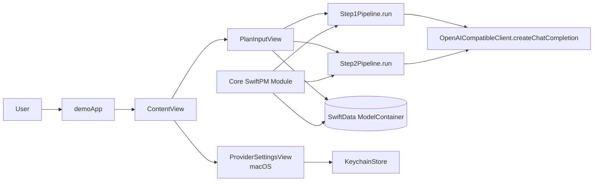
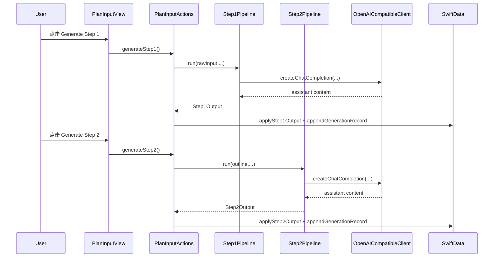
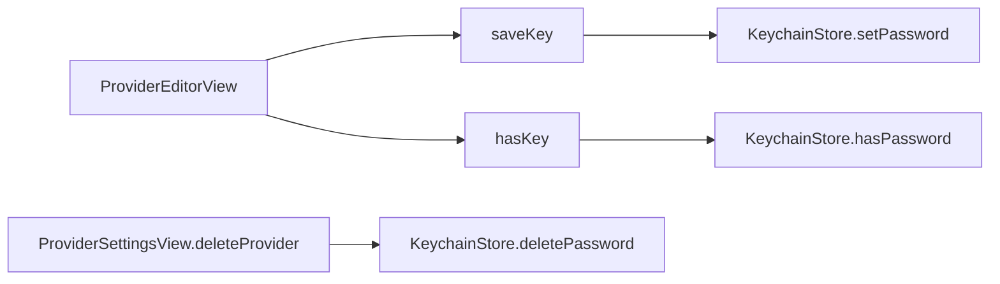

# Codebase Map

> Auto-generated by Cartographer. Last mapped: 2026-02-08T13:32:28Z

## 系统总览



核心结论：
- `demo` 是 UI 与交互壳层，`Core` 是领域模型、LLM 管线、导出与持久化基础层（refs: `demo/demoApp.swift:DemoApp`, `Core/Package.swift:Package`, `Core/Sources/Core/Persistence/CoreModelContainer.swift:CoreModelContainer.make`）。
- 计划生成是两阶段流程：Step1（输入→大纲/主张/引文）与 Step2（大纲→卡片/待办）（refs: `demo/PlanInputActions.swift:PlanInputView.generateStep1`, `demo/PlanInputActions.swift:PlanInputView.generateStep2`, `Core/Sources/Core/Pipeline/Step1Pipeline.swift:Step1Pipeline.run`, `Core/Sources/Core/Pipeline/Step2Pipeline.swift:Step2Pipeline.run`）。
- Provider 配置与 API Key 管理主要集中在 macOS 侧设置页面与 `KeychainStore`（refs: `demo/ProviderSettingsView.swift:ProviderSettingsView`, `demo/ProviderEditorView.swift:ProviderEditorView`, `demo/KeychainStore.swift:KeychainStore`）。

## 目录结构

```text
.
├── Core/                         # SwiftPM 领域核心
│   ├── Package.swift
│   ├── Sources/Core/
│   │   ├── Models/               # PlanDocument 与关联实体
│   │   ├── LLM/                  # OpenAI-compatible 客户端与预设
│   │   ├── Pipeline/             # Step1/Step2 生成与解码
│   │   ├── Export/               # CSV/TSV 导出
│   │   └── Persistence/          # SwiftData ModelContainer
│   └── Tests/CoreTests/
├── demo/                         # SwiftUI 应用层
│   ├── demoApp.swift             # App 入口 + ModelContainer 注入
│   ├── ContentView.swift         # 文档列表与主导航
│   ├── PlanInput*.swift          # 输入、生成、编辑、导出主功能
│   ├── PlanWorkspace*.swift      # 路由/侧边栏/详情框架
│   ├── ProviderSettingsView*.swift
│   ├── ProviderEditorView.swift
│   ├── KeychainStore.swift
│   └── Assets.xcassets/
├── demo.xcodeproj/               # Xcode 项目配置
├── docs/                         # 架构与项目说明文档
├── scripts/                      # 本地构建/启动脚本
└── README.md                     # 入口文档
```

## 模块导览

### Core（领域模型 + LLM 管线 + 导出）

**Purpose**：提供 `PlanDocument` 及其关联模型、两阶段 LLM pipeline、CSV/TSV 导出和 SwiftData 容器工厂（refs: `Core/Sources/Core/Models/PlanDocument.swift:PlanDocument`, `Core/Sources/Core/Pipeline/Step1Pipeline.swift:Step1Pipeline.run`, `Core/Sources/Core/Pipeline/Step2Pipeline.swift:Step2Pipeline.run`, `Core/Sources/Core/Export/FlashcardsExporter.swift:FlashcardsExporter.csv`, `Core/Sources/Core/Persistence/CoreModelContainer.swift:CoreModelContainer.make`）。

**Entry points**：
- `OpenAICompatibleClient.createChatCompletion`（refs: `Core/Sources/Core/LLM/OpenAICompatibleClient.swift:OpenAICompatibleClient.createChatCompletion`）
- `Step1Pipeline.run` / `Step2Pipeline.run`（refs: `Core/Sources/Core/Pipeline/Step1Pipeline.swift:Step1Pipeline.run`, `Core/Sources/Core/Pipeline/Step2Pipeline.swift:Step2Pipeline.run`）
- `FlashcardsExporter.tsv/csv`, `TodosExporter.csv`（refs: `Core/Sources/Core/Export/FlashcardsExporter.swift:FlashcardsExporter.tsv`, `Core/Sources/Core/Export/TodosExporter.swift:TodosExporter.csv`）

**Key files**：
| Path Group | Representative Files | Exceptions |
|------------|----------------------|------------|
| `Core/Sources/Core/Models/*` | `Core/Sources/Core/Models/PlanDocument.swift`, `Core/Sources/Core/Models/TodoItem.swift`, `Core/Sources/Core/Models/Flashcard.swift` | 无 |
| `Core/Sources/Core/LLM/*` | `Core/Sources/Core/LLM/OpenAICompatibleClient.swift`, `Core/Sources/Core/LLM/LLMProviderPreset.swift` | 无 |
| `Core/Sources/Core/Pipeline/*` | `Core/Sources/Core/Pipeline/Step1Pipeline.swift`, `Core/Sources/Core/Pipeline/Step2Pipeline.swift`, `Core/Sources/Core/Pipeline/Step1OutputDecoder.swift` | 无 |
| `Core/Sources/Core/Export/*` | `Core/Sources/Core/Export/FlashcardsExporter.swift`, `Core/Sources/Core/Export/TodosExporter.swift` | 无 |
| `Core/Tests/CoreTests/*` | `Core/Tests/CoreTests/CoreTests.swift` | 无 |

**Gotchas**：
- `Step1/Step2OutputDecoder` 采用“提取首个 JSON 块”的策略，面对多 JSON 或复杂文本时有解析歧义风险（refs: `Core/Sources/Core/Pipeline/Step1OutputDecoder.swift:Step1OutputDecoder.extractFirstJSONObjectString`, `Core/Sources/Core/Pipeline/Step2OutputDecoder.swift:Step2OutputDecoder.extractFirstJSONObjectString`）。
- `OpenAICompatibleClient` 只取第一条 choice 的 content，未覆盖 tool-call 等返回形态（refs: `Core/Sources/Core/LLM/OpenAICompatibleClient.swift:OpenAICompatibleClient.createChatCompletion`）。

### demo PlanInput 功能簇（输入/生成/编辑/导出）

**Purpose**：`PlanInputView` 作为功能根视图，负责用户输入、Step1/Step2 触发、生成结果写回模型、卡片与待办编辑、导出操作（refs: `demo/PlanInputView.swift:PlanInputView`, `demo/PlanInputActions.swift:PlanInputView.generateStep1`, `demo/PlanInputActions.swift:PlanInputView.generateStep2`, `demo/PlanInputGenerationSupport.swift:applyStep1Output`, `demo/PlanInputGenerationSupport.swift:applyStep2Output`）。

**Entry points**：
- `PlanInputView`（refs: `demo/PlanInputView.swift:PlanInputView`）
- `generateStep1` / `generateStep2`（refs: `demo/PlanInputActions.swift:PlanInputView.generateStep1`, `demo/PlanInputActions.swift:PlanInputView.generateStep2`）
- `cardsTab` / `todosTab` 与导出菜单（refs: `demo/PlanInputTabs.swift:PlanInputView.cardsTab`, `demo/PlanInputTabs.swift:PlanInputView.todosTab`, `demo/PlanInputTabs.swift:PlanInputView.cardsToolbar`）

**Key files**：
| Path Group | Representative Files | Exceptions |
|------------|----------------------|------------|
| `demo/PlanInput*.swift` | `demo/PlanInputView.swift`, `demo/PlanInputActions.swift`, `demo/PlanInputTabs.swift`, `demo/PlanInputEditors.swift`, `demo/PlanInputGenerationSupport.swift` | 无 |
| `demo/PlanLayoutComponents.swift` | `demo/PlanLayoutComponents.swift` | 无 |
| `demo/PlanUIComponents.swift` | `demo/PlanUIComponents.swift` | 无 |

**Gotchas**：
- Step1/Step2 重新生成会覆盖旧的衍生数据（卡片/待办/主张/引文），不是增量 merge（refs: `demo/PlanInputGenerationSupport.swift:applyStep1Output`, `demo/PlanInputGenerationSupport.swift:applyStep2Output`）。
- 导出目前依赖 `NSSavePanel`，非 AppKit 路径会落到错误提示分支（refs: `demo/PlanInputActions.swift:PlanInputView.exportTextFile`）。

### demo App 壳层、工作区与 Provider 管理

**Purpose**：管理 App 入口、文档列表导航、工作区路由切换、Provider CRUD 与激活状态、Keychain 密钥保存（refs: `demo/demoApp.swift:DemoApp`, `demo/ContentView.swift:ContentView`, `demo/PlanWorkspaceRoute.swift:PlanWorkspaceRoute`, `demo/ProviderSettingsView.swift:ProviderSettingsView`, `demo/ProviderEditorView.swift:ProviderEditorView`, `demo/KeychainStore.swift:KeychainStore`）。

**Entry points**：
- `DemoApp` + `ContentView`（refs: `demo/demoApp.swift:DemoApp`, `demo/ContentView.swift:ContentView`）
- `PlanWorkspaceSidebarView` + `PlanWorkspaceDetailView`（refs: `demo/PlanWorkspaceSidebarView.swift:PlanWorkspaceSidebarView`, `demo/PlanWorkspaceDetailView.swift:PlanWorkspaceDetailView`）
- `ProviderSettingsView` / `ProviderEditorView`（refs: `demo/ProviderSettingsView.swift:ProviderSettingsView`, `demo/ProviderEditorView.swift:ProviderEditorView`）

**Key files**：
| Path Group | Representative Files | Exceptions |
|------------|----------------------|------------|
| `demo/PlanWorkspace*.swift` | `demo/PlanWorkspaceRoute.swift`, `demo/PlanWorkspaceSidebarView.swift`, `demo/PlanWorkspaceDetailView.swift` | 无 |
| `demo/ProviderSettingsView*.swift` | `demo/ProviderSettingsView.swift`, `demo/ProviderSettingsView+Actions.swift`, `demo/ProviderSettingsView+Subviews.swift` | 无 |
| `demo/AppGlass+Modifiers.swift` | `demo/AppGlass+Modifiers.swift` | 无 |
| `demo/UIStyle.swift` | `demo/UIStyle.swift` | 无 |
| `demo/KeychainStore.swift` | `demo/KeychainStore.swift` | 无 |

**Gotchas**：
- `DemoApp.init` 中容器初始化失败会 `fatalError`，启动阶段缺乏降级（refs: `demo/demoApp.swift:DemoApp.init`）。
- Provider 删除时 keychain 清理用 `try?`，失败会被吞掉（refs: `demo/ProviderSettingsView+Actions.swift:ProviderSettingsView.deleteProvider`, `demo/KeychainStore.swift:KeychainStore.deletePassword`）。
- Provider 激活逻辑在 `ProviderSettingsView` 和 `ProviderEditorView` 各有一套，未来改动需同步（refs: `demo/ProviderSettingsView+Actions.swift:ProviderSettingsView.setActiveProviderID`, `demo/ProviderEditorView.swift:ProviderEditorView.setActive`）。

### 项目配置、文档与脚本

**Purpose**：提供构建入口、项目配置、架构文档与本地运行脚本（refs: `README.md`, `demo.xcodeproj/project.pbxproj:PBXNativeTarget`, `docs/PROJECT_OVERVIEW.md`, `docs/UI_ARCHITECTURE.md`, `scripts/launch-mac.sh:usage`）。

**Key files**：
| Path Group | Representative Files | Exceptions |
|------------|----------------------|------------|
| `docs/*` | `docs/PROJECT_OVERVIEW.md`, `docs/UI_ARCHITECTURE.md` | `docs/CODEBASE_MAP.md`（本文件） |
| `demo/Assets.xcassets/*` | `demo/Assets.xcassets/Contents.json`, `demo/Assets.xcassets/AppIcon.appiconset/Contents.json`, `demo/Assets.xcassets/AccentColor.colorset/Contents.json` | 无 |
| `demo.xcodeproj/*` | `demo.xcodeproj/project.pbxproj`, `demo.xcodeproj/project.xcworkspace/contents.xcworkspacedata` | 无 |
| `scripts/*` | `scripts/launch-mac.sh` | 无 |
| 根级配置 | `README.md`, `buildServer.json`, `.gitignore` | 无 |

**Gotchas**：
- `README` 的工具链描述与 project 元数据存在潜在版本口径差异，需要定期对齐（refs: `README.md:27`, `demo.xcodeproj/project.pbxproj:CreatedOnToolsVersion`, `demo.xcodeproj/project.pbxproj:LastUpgradeCheck`）。
- `scripts/launch-mac.sh` 默认输出目录 `DerivedData-launch-mac` 与 `.gitignore` 中 `DerivedData/` 规则并非同名，可能出现本地产物跟踪风险（refs: `scripts/launch-mac.sh:DERIVED_DATA_PATH`, `.gitignore:DerivedData/`）。

## 关键数据流

### 生成流程（Step1 / Step2）



### Provider 密钥流（macOS）



## 约定与实现模式

- 持久化基于 SwiftData：`DemoApp` 注入 `ModelContainer`，Core 侧统一 schema（refs: `demo/demoApp.swift:DemoApp.init`, `Core/Sources/Core/Persistence/CoreModelContainer.swift:CoreModelContainer.make`）。
- UI 采用“通用布局组件 + 功能视图”组合：`PlanLayoutComponents` 与 `PlanUIComponents` 是基础件（refs: `demo/PlanLayoutComponents.swift:AppRouteScaffold`, `demo/PlanUIComponents.swift:AppActionBar`）。
- 多平台分支明确：`ProviderSettingsView` 为 macOS 条件编译，`PlanInputView` 同时维护 iOS 与 macOS 布局路径（refs: `demo/ProviderSettingsView.swift:ProviderSettingsView`, `demo/PlanInputView.swift:PlanInputView.body`）。

## Navigation Guide

**常见任务 → 优先查看文件**

| 任务 | 首选文件 |
|------|----------|
| 调整两阶段提示词/输出结构 | `Core/Sources/Core/Pipeline/Step1Pipeline.swift`, `Core/Sources/Core/Pipeline/Step2Pipeline.swift`, `Core/Sources/Core/Pipeline/Step1Output.swift`, `Core/Sources/Core/Pipeline/Step2Output.swift` |
| 修改 LLM Provider 行为（baseURL/model/header） | `demo/ProviderEditorView.swift`, `demo/ProviderSettingsView+Actions.swift`, `Core/Sources/Core/Models/LLMProvider.swift`, `Core/Sources/Core/LLM/LLMProviderPreset.swift` |
| 修复“生成后数据覆盖/选择状态”问题 | `demo/PlanInputGenerationSupport.swift`, `demo/PlanInputActions.swift`, `demo/PlanInputView.swift`, `demo/PlanInputTabs.swift` |
| 调整卡片/待办导出格式 | `Core/Sources/Core/Export/FlashcardsExporter.swift`, `Core/Sources/Core/Export/TodosExporter.swift`, `demo/PlanInputActions.swift` |
| 调整主导航与工作区路由 | `demo/ContentView.swift`, `demo/PlanWorkspaceRoute.swift`, `demo/PlanWorkspaceSidebarView.swift`, `demo/PlanWorkspaceDetailView.swift` |
| 调整视觉风格（Glass/间距/色彩） | `demo/UIStyle.swift`, `demo/AppGlass+Modifiers.swift`, `demo/PlanLayoutComponents.swift`, `demo/PlanUIComponents.swift` |
| 本地构建/清理策略 | `scripts/launch-mac.sh`, `README.md`, `demo.xcodeproj/project.pbxproj` |

