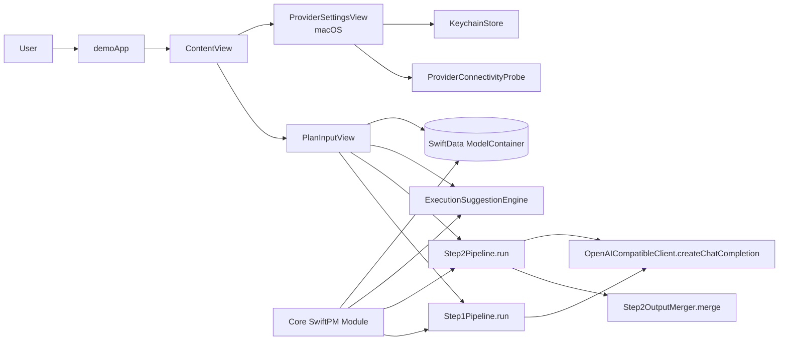
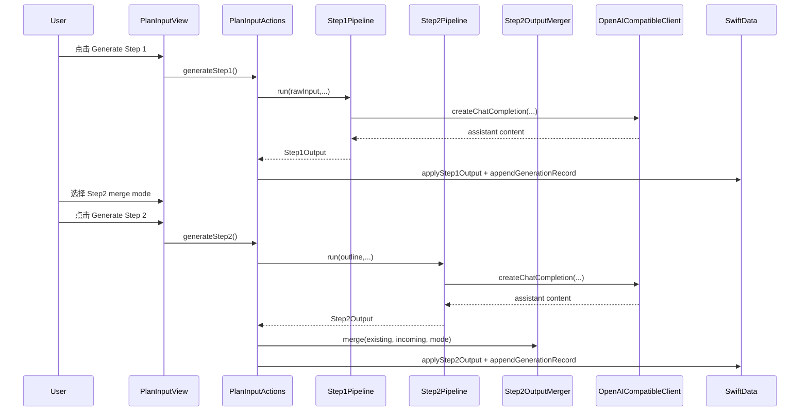
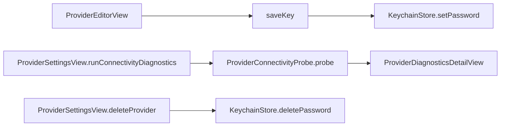

# Codebase Map

> Auto-generated by Cartographer. Last mapped: 2026-02-09T10:50:02Z

## 系统总览



核心结论：
- `demo` 是 UI 与交互壳层，`Core` 是领域模型、LLM 管线、执行建议、导出与持久化基础层（refs: `demo/demoApp.swift:DemoApp`, `Core/Package.swift:Package`, `Core/Sources/Core/Execution/ExecutionSuggestionEngine.swift:ExecutionSuggestionEngine.recommendations`）。
- 生成流程仍是两阶段：Step1（输入→大纲/主张/引文）与 Step2（大纲→卡片/待办），其中 Step2 支持 replace/merge 两种合并语义（refs: `demo/PlanInputActions.swift:PlanInputView.generateStep2`, `Core/Sources/Core/Pipeline/Step2Pipeline.swift:Step2Pipeline.run`, `Core/Sources/Core/Pipeline/Step2OutputMerger.swift:Step2OutputMerger.merge`）。
- Provider 管理已补充连通性诊断与引导文案，API Key 仍强制经 Keychain 存储（refs: `demo/ProviderSettingsView+Actions.swift:ProviderSettingsView.runConnectivityDiagnostics`, `demo/ProviderDiagnosticsDetailView.swift:ProviderDiagnosticsDetailView`, `demo/KeychainStore.swift:KeychainStore`）。

## 目录结构

```text
.
├── .beads/                       # git-backed issue tracker 数据与配置
├── Core/                         # SwiftPM 领域核心
│   ├── Package.swift
│   ├── Sources/Core/
│   │   ├── Models/               # PlanDocument/TodoItem/AutomationAuditEntry 等
│   │   ├── LLM/                  # OpenAI-compatible 客户端与 provider preset
│   │   ├── Pipeline/             # Step1/Step2 生成、解码与合并
│   │   ├── Execution/            # 执行建议、外部任务同步、provider 探测
│   │   ├── Export/               # Flashcards/Todos 导出
│   │   └── Persistence/          # SwiftData ModelContainer
│   └── Tests/CoreTests/
├── demo/                         # SwiftUI 应用层
│   ├── demoApp.swift             # App 入口 + ModelContainer 注入
│   ├── ContentView.swift         # 文档列表与主导航
│   ├── PlanInput*.swift          # 输入、生成、编辑、执行、导出主功能
│   ├── PlanWorkspace*.swift      # 路由/侧边栏/详情框架
│   ├── ProviderSettingsView*.swift
│   ├── ProviderEditorView.swift
│   ├── ProviderDiagnosticsDetailView.swift
│   ├── KeychainStore.swift
│   └── Assets.xcassets/
├── demo.xcodeproj/               # Xcode 项目配置
├── docs/                         # 架构与项目说明文档
├── docs/perf/                    # 本地性能测量记录
├── scripts/                      # 本地构建/启动脚本
└── README.md                     # 入口文档
```

## 模块导览

### Core（领域模型 + LLM 管线 + 执行层 + 导出）

**Purpose**：提供 `PlanDocument` 及其关联模型、两阶段 LLM pipeline、执行建议/同步、导出与 SwiftData 容器工厂（refs: `Core/Sources/Core/Models/PlanDocument.swift:PlanDocument`, `Core/Sources/Core/Pipeline/Step2Pipeline.swift:Step2Pipeline.run`, `Core/Sources/Core/Execution/ExternalTaskSync.swift:SyncConflictResolver.resolve`, `Core/Sources/Core/Export/TodosExporter.swift:TodosExporter.csvExtended`, `Core/Sources/Core/Persistence/CoreModelContainer.swift:CoreModelContainer.make`）。

**Entry points**：
- `OpenAICompatibleClient.createChatCompletion`（refs: `Core/Sources/Core/LLM/OpenAICompatibleClient.swift:OpenAICompatibleClient.createChatCompletion`）
- `Step1Pipeline.run` / `Step2Pipeline.run` + `Step2OutputMerger.merge`（refs: `Core/Sources/Core/Pipeline/Step1Pipeline.swift:Step1Pipeline.run`, `Core/Sources/Core/Pipeline/Step2Pipeline.swift:Step2Pipeline.run`, `Core/Sources/Core/Pipeline/Step2OutputMerger.swift:Step2OutputMerger.merge`）
- `ExecutionSuggestionEngine.recommendations` / `ProviderConnectivityProbe.probe`（refs: `Core/Sources/Core/Execution/ExecutionSuggestionEngine.swift:ExecutionSuggestionEngine.recommendations`, `Core/Sources/Core/Execution/ProviderConnectivityProbe.swift:ProviderConnectivityProbe.probe`）

**Key files**：
| Path Group | Representative Files | Exceptions |
|------------|----------------------|------------|
| `Core/Sources/Core/Models/*` | `Core/Sources/Core/Models/PlanDocument.swift`, `Core/Sources/Core/Models/TodoItem.swift`, `Core/Sources/Core/Models/AutomationAuditEntry.swift` | 无 |
| `Core/Sources/Core/LLM/*` | `Core/Sources/Core/LLM/OpenAICompatibleClient.swift`, `Core/Sources/Core/LLM/LLMProviderPreset.swift` | 无 |
| `Core/Sources/Core/Pipeline/*` | `Core/Sources/Core/Pipeline/Step1Pipeline.swift`, `Core/Sources/Core/Pipeline/Step2Pipeline.swift`, `Core/Sources/Core/Pipeline/Step2OutputMerger.swift` | 无 |
| `Core/Sources/Core/Execution/*` | `Core/Sources/Core/Execution/ExecutionSuggestionEngine.swift`, `Core/Sources/Core/Execution/ExternalTaskSync.swift`, `Core/Sources/Core/Execution/ProviderConnectivityProbe.swift` | 无 |
| `Core/Sources/Core/Export/*` | `Core/Sources/Core/Export/FlashcardsExporter.swift`, `Core/Sources/Core/Export/TodosExporter.swift` | 无 |
| `Core/Tests/CoreTests/*` | `Core/Tests/CoreTests/CoreTests.swift`, `Core/Tests/CoreTests/Step2OutputMergerTests.swift`, `Core/Tests/CoreTests/AutomationGovernanceTests.swift` | 无 |

**Gotchas**：
- Step2 `step2-v2` 输出的 `status/priority/schedule` 字段是可选项，兼容旧 payload 时需容忍 `nil`（refs: `Core/Sources/Core/Pipeline/Step2Output.swift:Step2Output.Todo`, `Core/Tests/CoreTests/Step2OutputDecoderCompatibilityTests.swift:step2DecoderRemainsCompatibleWithV1Payload`）。
- 冲突策略在 `requiresManualReview` 为 `true` 时不会自动落地，需要 UI 明确处理待审核状态（refs: `Core/Sources/Core/Execution/ExternalTaskSync.swift:SyncConflictResolver.apply`）。
- `csvExtended` 会把换行规范化为 `<br>`，下游若依赖原始换行需自行逆变换（refs: `Core/Sources/Core/Export/TodosExporter.swift:TodosExporter.sanitizeCSVField`）。

### demo PlanInput 功能簇（输入/生成/编辑/执行/导出）

**Purpose**：`PlanInputView` 作为功能根视图，统一输入编辑、Step1/Step2 触发、结果写回、卡片与待办编辑、执行建议与导出操作（refs: `demo/PlanInputView.swift:PlanInputView`, `demo/PlanInputActions.swift:PlanInputView.generateStep1`, `demo/PlanInputActions.swift:PlanInputView.generateStep2`, `demo/PlanInputExecutionTab.swift:PlanInputView.executionTab`）。

**Entry points**：
- `PlanInputView`（refs: `demo/PlanInputView.swift:PlanInputView`）
- `generateStep1` / `generateStep2`（refs: `demo/PlanInputActions.swift:PlanInputView.generateStep1`, `demo/PlanInputActions.swift:PlanInputView.generateStep2`）
- `cardsTab` / `todosTab` / `executionTab`（refs: `demo/PlanInputTabs.swift:PlanInputView.cardsTab`, `demo/PlanInputTabs.swift:PlanInputView.todosTab`, `demo/PlanInputExecutionTab.swift:PlanInputView.executionTab`）

**Key files**：
| Path Group | Representative Files | Exceptions |
|------------|----------------------|------------|
| `demo/PlanInput*.swift` | `demo/PlanInputView.swift`, `demo/PlanInputActions.swift`, `demo/PlanInputTabs.swift`, `demo/PlanInputExecutionTab.swift`, `demo/PlanInputExecutionAutomation.swift`, `demo/PlanInputEditorsEvidence.swift` | 无 |
| `demo/PlanLayoutComponents.swift` | `demo/PlanLayoutComponents.swift` | 无 |
| `demo/PlanUIComponents.swift` | `demo/PlanUIComponents.swift` | 无 |

**Gotchas**：
- Step2 在 `.replace` 模式会清空旧 `flashcards/todos`，只有 `.merge` 才是增量行为（refs: `demo/PlanInputGenerationSupport.swift:applyStep2Output`）。
- 执行同步受 `automationPermissionPolicy` 与 `syncOwnershipPolicy` 约束，某些策略只会进入待审核队列（refs: `demo/PlanInputExecutionAutomation.swift:queueSyncByAutomationPolicyIfNeeded`）。
- 性能自动化环境变量只用于 profiling，不应当作产品默认行为（refs: `demo/demoApp.swift:DemoApp.init`, `demo/PlanInputView+PerformanceAutomation.swift:PlanInputView.setupRouteAutomationIfNeeded`）。

### demo App 壳层、工作区与 Provider 管理

**Purpose**：管理 App 入口、文档列表导航、工作区路由切换、Provider CRUD/诊断与 Keychain 密钥保存（refs: `demo/demoApp.swift:DemoApp`, `demo/ContentView.swift:ContentView`, `demo/PlanWorkspaceRoute.swift:PlanWorkspaceRoute`, `demo/ProviderSettingsView.swift:ProviderSettingsView`, `demo/ProviderDiagnosticsDetailView.swift:ProviderDiagnosticsDetailView`）。

**Entry points**：
- `DemoApp` + `ContentView`（refs: `demo/demoApp.swift:DemoApp`, `demo/ContentView.swift:ContentView`）
- `PlanWorkspaceSidebarView` + `PlanWorkspaceDetailView`（refs: `demo/PlanWorkspaceSidebarView.swift:PlanWorkspaceSidebarView`, `demo/PlanWorkspaceDetailView.swift:PlanWorkspaceDetailView`）
- `ProviderSettingsView` / `ProviderEditorView` / `ProviderDiagnosticsDetailView`（refs: `demo/ProviderSettingsView.swift:ProviderSettingsView`, `demo/ProviderEditorView.swift:ProviderEditorView`, `demo/ProviderDiagnosticsDetailView.swift:ProviderDiagnosticsDetailView`）

**Key files**：
| Path Group | Representative Files | Exceptions |
|------------|----------------------|------------|
| `demo/PlanWorkspace*.swift` | `demo/PlanWorkspaceRoute.swift`, `demo/PlanWorkspaceSidebarView.swift`, `demo/PlanWorkspaceDetailView.swift` | 无 |
| `demo/ProviderSettingsView*.swift` | `demo/ProviderSettingsView.swift`, `demo/ProviderSettingsView+Actions.swift`, `demo/ProviderSettingsView+Subviews.swift` | 无 |
| `demo/ProviderEditorView.swift` | `demo/ProviderEditorView.swift` | 无 |
| `demo/ProviderDiagnosticsDetailView.swift` | `demo/ProviderDiagnosticsDetailView.swift` | 无 |
| `demo/UIStyle.swift` | `demo/UIStyle.swift` | 无 |
| `demo/KeychainStore.swift` | `demo/KeychainStore.swift` | 无 |

**Gotchas**：
- `DemoApp.init` 中容器初始化失败仍会 `fatalError`（refs: `demo/demoApp.swift:DemoApp.init`）。
- Provider 删除时 Keychain 清理使用 `try?`，失败不会直接上抛（refs: `demo/ProviderSettingsView+Actions.swift:ProviderSettingsView.deleteProvider`, `demo/KeychainStore.swift:KeychainStore.deletePassword`）。
- 连通性诊断会截断响应体摘要，超长错误文本需要额外日志辅助（refs: `Core/Sources/Core/Execution/ProviderConnectivityProbe.swift:ProviderConnectivityProbe.responseBodySummary`）。

### 项目配置、文档与脚本

**Purpose**：提供构建入口、项目配置、架构文档、性能记录与本地运行脚本（refs: `README.md`, `AGENTS.md`, `docs/PROJECT_OVERVIEW.md`, `docs/perf/2026-02-09-ui-switching-metrics.md`, `scripts/launch-mac.sh:usage`）。

**Key files**：
| Path Group | Representative Files | Exceptions |
|------------|----------------------|------------|
| `.beads/*.jsonl` | `.beads/issues.jsonl`, `.beads/interactions.jsonl` | `.beads/interactions.jsonl` 可能为空 |
| `.beads/*.yaml` | `.beads/config.yaml` | 无 |
| `.beads/*.md` | `.beads/README.md` | 无 |
| `docs/perf/*` | `docs/perf/2026-02-09-ui-switching-metrics.md` | 无 |
| `demo/Assets.xcassets/*` | `demo/Assets.xcassets/Contents.json`, `demo/Assets.xcassets/AppIcon.appiconset/Contents.json` | `demo/Assets.xcassets/AccentColor.colorset/Contents.json` |
| `demo.xcodeproj/*` | `demo.xcodeproj/project.pbxproj`, `demo.xcodeproj/project.xcworkspace/contents.xcworkspacedata` | 无 |
| `scripts/launch-mac.sh` | `scripts/launch-mac.sh` | 无 |
| 根级配置 | `README.md`, `AGENTS.md`, `.gitignore`, `.gitattributes`, `buildServer.json` | 无 |

**Gotchas**：
- `README` 的工具链描述与 project metadata 需要持续对齐（refs: `README.md:27`, `demo.xcodeproj/project.pbxproj:LastUpgradeCheck`）。
- `scripts/launch-mac.sh` 的安全删除策略限制路径必须在仓库内，错误路径会直接退出（refs: `scripts/launch-mac.sh:is_safe_delete_path`）。
- `.beads/issues.jsonl` 由 merge driver 管理，协作时需遵循 `.gitattributes` 指定策略（refs: `.gitattributes:beads/issues.jsonl merge=beads`）。

## 关键数据流

### 生成流程（Step1 / Step2）



### Provider 密钥与诊断流（macOS）



## 约定与实现模式

- 持久化基于 SwiftData：`DemoApp` 注入 `ModelContainer`，Core 侧通过 `CoreModelContainer` 统一 schema（refs: `demo/demoApp.swift:DemoApp.init`, `Core/Sources/Core/Persistence/CoreModelContainer.swift:CoreModelContainer.make`）。
- 模型层使用 raw 值 + 计算属性桥接枚举，兼顾持久化兼容性与调用端类型安全（refs: `Core/Sources/Core/Models/TodoItem.swift:TodoItem.status`, `Core/Sources/Core/Models/PlanDocument.swift:PlanDocument.automationPermissionPolicy`）。
- UI 层维持“通用布局组件 + 功能视图”组合：`PlanLayoutComponents`/`PlanUIComponents` 提供骨架，`PlanInput*` 聚焦业务（refs: `demo/PlanLayoutComponents.swift:AppRouteScaffold`, `demo/PlanUIComponents.swift:AppActionBar`）。
- 性能文档采用可复现脚本与环境变量开关记录，`docs/perf/*` 仅用于本地调优证据（refs: `docs/perf/2026-02-09-ui-switching-metrics.md`, `demo/PlanInputView+PerformanceAutomation.swift:PlanInputView.setupRouteAutomationIfNeeded`）。

## Navigation Guide

**常见任务 → 优先查看文件**

| 任务 | 首选文件 |
|------|----------|
| 调整两阶段提示词/输出结构 | `Core/Sources/Core/Pipeline/Step1Pipeline.swift`, `Core/Sources/Core/Pipeline/Step2Pipeline.swift`, `Core/Sources/Core/Pipeline/Step2Output.swift`, `Core/Sources/Core/Pipeline/Step2OutputMerger.swift` |
| 修改 Step2 合并语义（replace/merge） | `demo/PlanInputActions.swift`, `demo/PlanInputGenerationSupport.swift`, `Core/Sources/Core/Pipeline/Step2OutputMerger.swift`, `Core/Tests/CoreTests/Step2OutputMergerTests.swift` |
| 调整执行建议/外部同步/自动化审核 | `Core/Sources/Core/Execution/ExecutionSuggestionEngine.swift`, `Core/Sources/Core/Execution/ExternalTaskSync.swift`, `demo/PlanInputExecutionAutomation.swift`, `demo/PlanInputExecutionTab.swift` |
| 修改 Provider 诊断与 API Key 流程 | `demo/ProviderSettingsView+Actions.swift`, `demo/ProviderDiagnosticsDetailView.swift`, `Core/Sources/Core/Execution/ProviderConnectivityProbe.swift`, `demo/ProviderEditorView.swift` |
| 调整卡片/待办导出格式 | `Core/Sources/Core/Export/FlashcardsExporter.swift`, `Core/Sources/Core/Export/TodosExporter.swift`, `demo/PlanInputActions.swift` |
| 调整主导航与工作区路由 | `demo/ContentView.swift`, `demo/PlanWorkspaceRoute.swift`, `demo/PlanWorkspaceSidebarView.swift`, `demo/PlanWorkspaceDetailView.swift` |
| 调整视觉风格（Glass/间距/色彩） | `demo/UIStyle.swift`, `demo/AppGlass+Modifiers.swift`, `demo/PlanLayoutComponents.swift`, `demo/PlanUIComponents.swift` |
| 本地构建/清理与性能复现 | `scripts/launch-mac.sh`, `README.md`, `docs/perf/2026-02-09-ui-switching-metrics.md`, `demo/demoApp.swift` |
