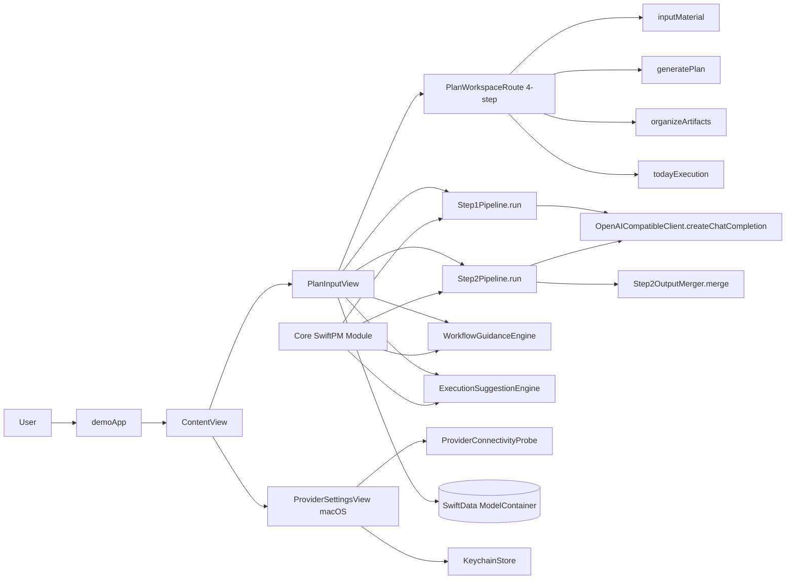
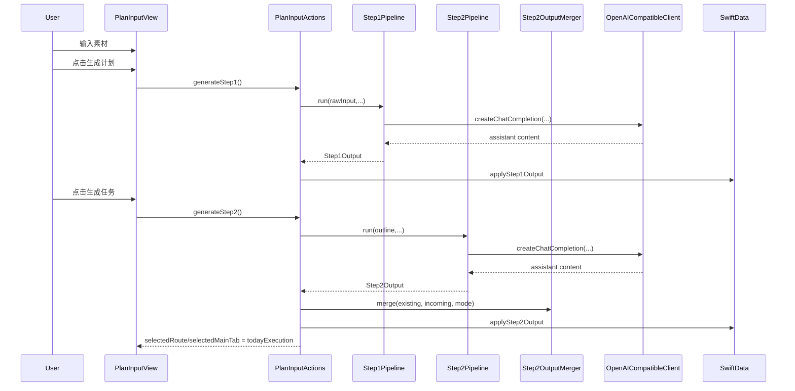
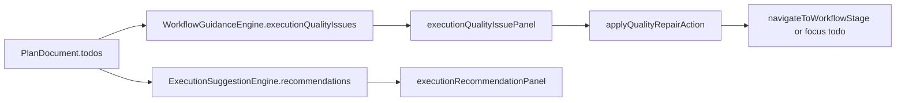
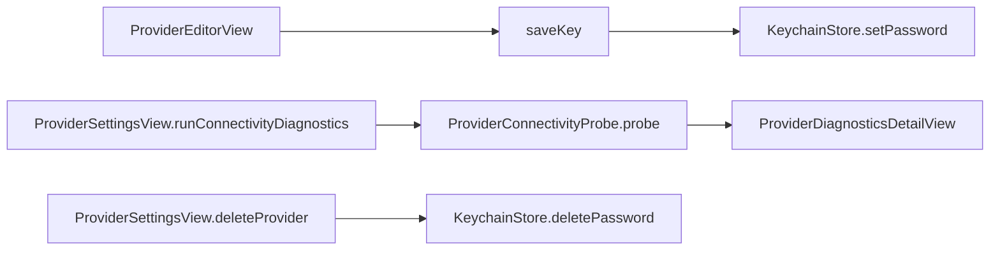

# Codebase Map

> Auto-generated by Cartographer. Last mapped: 2026-02-09T12:45:00Z

## 系统总览



核心结论：
- `demo` 负责流程化交互壳层；`Core` 承载模型、LLM pipeline、执行建议/质量反馈与持久化能力（refs: `demo/demoApp.swift:DemoApp`, `Core/Package.swift:Package`, `Core/Sources/Core/Execution/WorkflowGuidanceEngine.swift:WorkflowGuidanceEngine`）。
- macOS 主工作区已统一为四步 IA：`输入素材 → 生成计划 → 整理产物 → 今日执行`，并通过统一 route/tab 语义保持 iOS 编译一致（refs: `demo/PlanWorkspaceRoute.swift:PlanWorkspaceRoute`, `demo/PlanInputView.swift:PlanInputMainTab`）。
- Step2 成功后会自动跳转至“今日执行”；质量反馈采用 warning 卡片 + 快捷修复动作，不阻断主流程（refs: `demo/PlanInputActionsGeneration.swift:PlanInputView.generateStep2`, `demo/PlanInputExecutionQuality.swift:PlanInputView.executionQualityIssuePanel`）。

## 目录结构

```text
.
├── .beads/                       # git-backed issue tracker 数据与配置
├── Core/                         # SwiftPM 领域核心
│   ├── Package.swift
│   ├── Sources/Core/
│   │   ├── Models/               # PlanDocument/TodoItem/AutomationAuditEntry
│   │   ├── LLM/                  # OpenAI-compatible 客户端与 Provider preset
│   │   ├── Pipeline/             # Step1/Step2 生成、解码与合并
│   │   ├── Execution/            # 执行建议、外部同步、Provider 探测、流程质量引擎
│   │   ├── Export/               # Flashcards/Todos 导出
│   │   └── Persistence/          # SwiftData ModelContainer
│   └── Tests/CoreTests/
├── demo/                         # SwiftUI 应用层
│   ├── demoApp.swift             # App 入口 + ModelContainer 注入
│   ├── ContentView.swift         # 文档列表与主导航
│   ├── PlanWorkspace*.swift      # 四步路由/侧栏/详情框架
│   ├── PlanInput*.swift          # 四步页面、生成动作、执行台、编辑与导出
│   ├── PlanWorkflowProgressView.swift
│   ├── ProviderSettingsView*.swift
│   ├── ProviderEditorView.swift
│   ├── ProviderDiagnosticsDetailView.swift
│   ├── KeychainStore.swift
│   └── Assets.xcassets/
├── demo.xcodeproj/
├── docs/
├── docs/perf/
├── scripts/
└── README.md
```

## 模块导览

### Core（领域模型 + LLM 管线 + 执行层 + 导出）

**Purpose**：提供 `PlanDocument` 及关联模型、两阶段 LLM pipeline、执行建议与流程质量反馈、导出和 SwiftData 容器工厂（refs: `Core/Sources/Core/Models/PlanDocument.swift:PlanDocument`, `Core/Sources/Core/Pipeline/Step2Pipeline.swift:Step2Pipeline.run`, `Core/Sources/Core/Execution/WorkflowGuidanceEngine.swift:WorkflowGuidanceEngine.progress`, `Core/Sources/Core/Execution/ExecutionSuggestionEngine.swift:ExecutionSuggestionEngine.recommendations`, `Core/Sources/Core/Persistence/CoreModelContainer.swift:CoreModelContainer.make`）。

**Entry points**：
- `OpenAICompatibleClient.createChatCompletion`（refs: `Core/Sources/Core/LLM/OpenAICompatibleClient.swift:OpenAICompatibleClient.createChatCompletion`）
- `Step1Pipeline.run` / `Step2Pipeline.run` + `Step2OutputMerger.merge`（refs: `Core/Sources/Core/Pipeline/Step1Pipeline.swift:Step1Pipeline.run`, `Core/Sources/Core/Pipeline/Step2Pipeline.swift:Step2Pipeline.run`, `Core/Sources/Core/Pipeline/Step2OutputMerger.swift:Step2OutputMerger.merge`）
- `WorkflowGuidanceEngine.progress` / `WorkflowGuidanceEngine.executionQualityIssues`（refs: `Core/Sources/Core/Execution/WorkflowGuidanceEngine.swift:WorkflowGuidanceEngine.progress`, `Core/Sources/Core/Execution/WorkflowGuidanceEngine.swift:WorkflowGuidanceEngine.executionQualityIssues`）

**Key files**：
| Path Group | Representative Files | Exceptions |
|------------|----------------------|------------|
| `Core/Sources/Core/Models/*` | `Core/Sources/Core/Models/PlanDocument.swift`, `Core/Sources/Core/Models/TodoItem.swift`, `Core/Sources/Core/Models/AutomationAuditEntry.swift` | 无 |
| `Core/Sources/Core/LLM/*` | `Core/Sources/Core/LLM/OpenAICompatibleClient.swift`, `Core/Sources/Core/LLM/LLMProviderPreset.swift` | 无 |
| `Core/Sources/Core/Pipeline/*` | `Core/Sources/Core/Pipeline/Step1Pipeline.swift`, `Core/Sources/Core/Pipeline/Step2Pipeline.swift`, `Core/Sources/Core/Pipeline/Step2OutputMerger.swift` | 无 |
| `Core/Sources/Core/Execution/*` | `Core/Sources/Core/Execution/WorkflowGuidanceEngine.swift`, `Core/Sources/Core/Execution/ExecutionSuggestionEngine.swift`, `Core/Sources/Core/Execution/ExternalTaskSync.swift`, `Core/Sources/Core/Execution/ProviderConnectivityProbe.swift` | 无 |
| `Core/Sources/Core/Export/*` | `Core/Sources/Core/Export/FlashcardsExporter.swift`, `Core/Sources/Core/Export/TodosExporter.swift` | 无 |
| `Core/Tests/CoreTests/*` | `Core/Tests/CoreTests/WorkflowGuidanceEngineTests.swift`, `Core/Tests/CoreTests/Step2OutputMergerTests.swift`, `Core/Tests/CoreTests/AutomationGovernanceTests.swift` | 无 |

**Gotchas**：
- Step2 `step2-v2` 输出的 `status/priority/schedule` 是可选字段，必须继续兼容旧 payload（refs: `Core/Sources/Core/Pipeline/Step2Output.swift:Step2Output.Todo`, `Core/Tests/CoreTests/Step2OutputDecoderCompatibilityTests.swift:step2DecoderRemainsCompatibleWithV1Payload`）。
- `executionQualityIssues` 只给提示不做自动修复，修复动作由 UI 执行跳转/聚焦（refs: `Core/Sources/Core/Execution/WorkflowGuidanceEngine.swift:WorkflowQualityRepairAction`, `demo/PlanInputExecutionQuality.swift:PlanInputView.applyQualityRepairAction`）。
- `csvExtended` 会把换行规范化成 `<br>`，下游若依赖原始换行需自行逆变换（refs: `Core/Sources/Core/Export/TodosExporter.swift:TodosExporter.sanitizeCSVField`）。

### demo PlanInput 功能簇（四步流程工作区）

**Purpose**：`PlanInputView` 统一四步流程、两阶段生成、产物整理与执行台操作，确保“任务 + 执行”在同一上下文完成（refs: `demo/PlanInputView.swift:PlanInputView`, `demo/PlanInputTabs.swift:PlanInputView.generatePlanView`, `demo/PlanInputExecutionTab.swift:PlanInputView.todayExecutionView`）。

**Entry points**：
- `PlanInputView`（refs: `demo/PlanInputView.swift:PlanInputView`）
- `workflowProgressView` + `navigateToWorkflowStage`（refs: `demo/PlanWorkflowProgressView.swift:PlanInputView.workflowProgressView`, `demo/PlanWorkflowProgressView.swift:PlanInputView.navigateToWorkflowStage`）
- `generateStep1` / `generateStep2`（refs: `demo/PlanInputActionsGeneration.swift:PlanInputView.generateStep1`, `demo/PlanInputActionsGeneration.swift:PlanInputView.generateStep2`）
- `organizeArtifactsView` / `todayExecutionView`（refs: `demo/PlanInputTabs.swift:PlanInputView.organizeArtifactsView`, `demo/PlanInputExecutionTab.swift:PlanInputView.todayExecutionView`）

**Key files**：
| Path Group | Representative Files | Exceptions |
|------------|----------------------|------------|
| `demo/PlanInput*.swift` | `demo/PlanInputView.swift`, `demo/PlanInputActions.swift`, `demo/PlanInputActionsGeneration.swift`, `demo/PlanInputTabs.swift`, `demo/PlanInputTabsSupport.swift`, `demo/PlanInputExecutionTab.swift`, `demo/PlanInputExecutionQuality.swift`, `demo/PlanInputExecutionFiltering.swift`, `demo/PlanInputExecutionAutomation.swift`, `demo/PlanInputExecutionRows.swift` | `demo/PlanInputEditorsEvidence.swift`（证据编辑细节） |
| `demo/PlanWorkflowProgressView.swift` | `demo/PlanWorkflowProgressView.swift` | 无 |
| `demo/PlanLayoutComponents.swift` | `demo/PlanLayoutComponents.swift` | 无 |
| `demo/PlanUIComponents.swift` | `demo/PlanUIComponents.swift` | 无 |

**Gotchas**：
- `generatePlanView` 把 Step1/Step2、覆盖/合并放在“高级设置”收敛，不要把复杂术语重新散落到一级交互（refs: `demo/PlanInputTabs.swift:PlanInputView.generatePlanView`）。
- Step2 成功后会重置次级视图到 `overview` 并自动跳转今日执行（refs: `demo/PlanInputActionsGeneration.swift:PlanInputView.generateStep2`）。
- “整理产物”默认展示总览，卡片/引用/记录通过“更多”菜单进入（refs: `demo/PlanInputTabs.swift:PlanInputView.organizeArtifactsView`）。

### demo App 壳层、工作区与 Provider 管理

**Purpose**：负责 App 入口、文档导航、四步侧边路由、Provider CRUD/诊断和 Keychain API Key 持久化（refs: `demo/demoApp.swift:DemoApp`, `demo/ContentView.swift:ContentView`, `demo/PlanWorkspaceSidebarView.swift:PlanWorkspaceSidebarView`, `demo/ProviderSettingsView.swift:ProviderSettingsView`）。

**Entry points**：
- `DemoApp` + `ContentView`（refs: `demo/demoApp.swift:DemoApp`, `demo/ContentView.swift:ContentView`）
- `PlanWorkspaceRoute` + `PlanWorkspaceSidebarView` + `PlanWorkspaceDetailView`（refs: `demo/PlanWorkspaceRoute.swift:PlanWorkspaceRoute`, `demo/PlanWorkspaceSidebarView.swift:PlanWorkspaceSidebarView`, `demo/PlanWorkspaceDetailView.swift:PlanWorkspaceDetailView`）
- `ProviderSettingsView` / `ProviderEditorView` / `ProviderDiagnosticsDetailView`（refs: `demo/ProviderSettingsView.swift:ProviderSettingsView`, `demo/ProviderEditorView.swift:ProviderEditorView`, `demo/ProviderDiagnosticsDetailView.swift:ProviderDiagnosticsDetailView`）

**Key files**：
| Path Group | Representative Files | Exceptions |
|------------|----------------------|------------|
| `demo/PlanWorkspace*.swift` | `demo/PlanWorkspaceRoute.swift`, `demo/PlanWorkspaceSidebarView.swift`, `demo/PlanWorkspaceDetailView.swift` | 无 |
| `demo/ProviderSettingsView*.swift` | `demo/ProviderSettingsView.swift`, `demo/ProviderSettingsView+Actions.swift`, `demo/ProviderSettingsView+Subviews.swift` | 无 |
| `demo/ProviderEditorView.swift` | `demo/ProviderEditorView.swift` | 无 |
| `demo/ProviderDiagnosticsDetailView.swift` | `demo/ProviderDiagnosticsDetailView.swift` | 无 |
| `demo/KeychainStore.swift` | `demo/KeychainStore.swift` | 无 |

**Gotchas**：
- `DemoApp.init` 中容器初始化失败仍会 `fatalError`（refs: `demo/demoApp.swift:DemoApp.init`）。
- Provider 删除时 Keychain 清理使用 `try?`，失败不会上抛（refs: `demo/ProviderSettingsView+Actions.swift:ProviderSettingsView.deleteProvider`, `demo/KeychainStore.swift:KeychainStore.deletePassword`）。
- Provider 默认不自动弹出大量成功提示，减少工作流干扰（refs: `demo/ProviderEditorView.swift:ProviderEditorView.setActive`, `demo/ProviderSettingsView+Actions.swift:ProviderSettingsView.setActiveProvider`）。

### 项目配置、文档与脚本

**Purpose**：提供构建入口、项目配置、架构文档、性能记录与本地运行脚本（refs: `README.md`, `AGENTS.md`, `docs/PROJECT_OVERVIEW.md`, `docs/UI_ARCHITECTURE.md`, `scripts/launch-mac.sh:usage`）。

**Key files**：
| Path Group | Representative Files | Exceptions |
|------------|----------------------|------------|
| `.beads/*.jsonl` | `.beads/issues.jsonl`, `.beads/interactions.jsonl` | `.beads/interactions.jsonl` 可能为空 |
| `.beads/*.yaml` | `.beads/config.yaml` | 无 |
| `.beads/*.md` | `.beads/README.md` | 无 |
| `docs/perf/*` | `docs/perf/2026-02-09-ui-switching-metrics.md` | 无 |
| `demo/Assets.xcassets/*` | `demo/Assets.xcassets/Contents.json`, `demo/Assets.xcassets/AppIcon.appiconset/Contents.json` | `demo/Assets.xcassets/AccentColor.colorset/Contents.json` |
| `demo.xcodeproj/*` | `demo.xcodeproj/project.pbxproj`, `demo.xcodeproj/project.xcworkspace/contents.xcworkspacedata` | 无 |
| `scripts/launch-mac.sh` | `scripts/launch-mac.sh` | 无 |
| 根级配置 | `README.md`, `AGENTS.md`, `.gitignore`, `.gitattributes`, `buildServer.json` | 无 |

## 关键数据流

### 生成流程（Step1 / Step2）



### 执行台提示流（今日执行）



### Provider 密钥与诊断流（macOS）



## 约定与实现模式

- 持久化基于 SwiftData：`DemoApp` 注入 `ModelContainer`，Core 侧通过 `CoreModelContainer` 统一 schema（refs: `demo/demoApp.swift:DemoApp.init`, `Core/Sources/Core/Persistence/CoreModelContainer.swift:CoreModelContainer.make`）。
- 模型层通过 raw 值 + 计算属性桥接枚举，兼顾持久化兼容性与类型安全（refs: `Core/Sources/Core/Models/TodoItem.swift:TodoItem.status`, `Core/Sources/Core/Models/PlanDocument.swift:PlanDocument.automationPermissionPolicy`）。
- UI 层维持“布局组件 + 功能视图”组合：`PlanLayoutComponents` / `PlanUIComponents` 提供壳层，`PlanInput*` 聚焦业务与交互（refs: `demo/PlanLayoutComponents.swift:AppRouteScaffold`, `demo/PlanUIComponents.swift:AppActionBar`）。
- 质量反馈采用“提示优先”策略：仅提示与导航，不自动改写任务数据（refs: `demo/PlanInputExecutionQuality.swift:PlanInputView.executionQualityIssuePanel`, `Core/Sources/Core/Execution/WorkflowGuidanceEngine.swift:WorkflowQualityIssue`）。

## Navigation Guide

**常见任务 → 优先查看文件**

| 任务 | 首选文件 |
|------|----------|
| 调整四步主导航（侧栏/快捷键/详情切换） | `demo/PlanWorkspaceRoute.swift`, `demo/PlanWorkspaceSidebarView.swift`, `demo/PlanWorkspaceDetailView.swift`, `demo/PlanInputView.swift` |
| 调整 Step1/Step2 生成动作与跳转行为 | `demo/PlanInputActions.swift`, `demo/PlanInputActionsGeneration.swift`, `demo/PlanInputGenerationSupport.swift`, `Core/Sources/Core/Pipeline/Step1Pipeline.swift`, `Core/Sources/Core/Pipeline/Step2Pipeline.swift` |
| 调整“整理产物”默认总览与更多入口 | `demo/PlanInputTabs.swift`, `demo/PlanInputEditors.swift`, `demo/PlanInputEditorsEvidence.swift` |
| 调整“今日执行”列表、建议、高级抽屉 | `demo/PlanInputExecutionTab.swift`, `demo/PlanInputExecutionFiltering.swift`, `demo/PlanInputExecutionQuality.swift`, `demo/PlanInputExecutionRows.swift`, `demo/PlanInputExecutionAutomation.swift` |
| 调整执行质量提示规则 | `Core/Sources/Core/Execution/WorkflowGuidanceEngine.swift`, `Core/Tests/CoreTests/WorkflowGuidanceEngineTests.swift`, `demo/PlanInputExecutionQuality.swift` |
| 修改 Provider 诊断与 API Key 流程 | `demo/ProviderSettingsView+Actions.swift`, `demo/ProviderDiagnosticsDetailView.swift`, `Core/Sources/Core/Execution/ProviderConnectivityProbe.swift`, `demo/ProviderEditorView.swift` |
| 调整导出格式（卡片/任务） | `Core/Sources/Core/Export/FlashcardsExporter.swift`, `Core/Sources/Core/Export/TodosExporter.swift`, `demo/PlanInputActions.swift`, `demo/PlanInputActionsGeneration.swift` |
| 本地构建/清理与性能复现 | `scripts/launch-mac.sh`, `README.md`, `docs/perf/2026-02-09-ui-switching-metrics.md`, `demo/demoApp.swift` |
