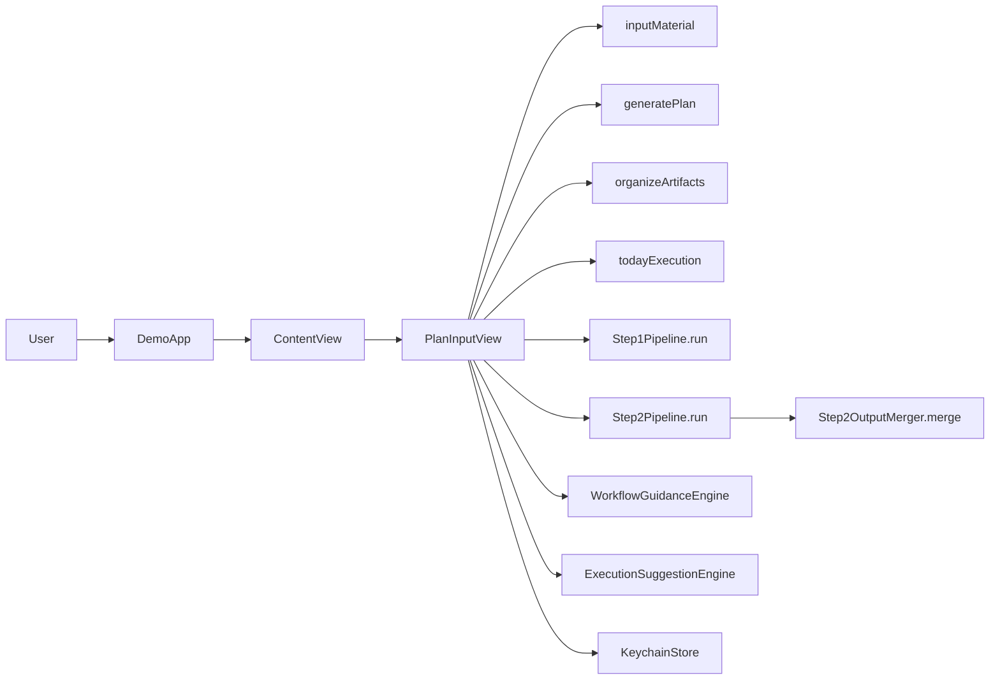

# CODEBASE_MAP

## System Overview

## Module Guide

### `Core/`

- Responsibility: domain model, generation pipeline, execution intelligence, export, persistence.
- Entrypoints:
  - `Core/Sources/Core/LLM/OpenAICompatibleClient.swift`
  - `Core/Sources/Core/Pipeline/Step1Pipeline.swift`
  - `Core/Sources/Core/Pipeline/Step2Pipeline.swift`
  - `Core/Sources/Core/Execution/WorkflowGuidanceEngine.swift`
  - `Core/Sources/Core/Execution/ExecutionSuggestionEngine.swift`
- Critical files:
  - `Core/Sources/Core/Pipeline/Step1OutputDecoder.swift`
  - `Core/Sources/Core/Pipeline/Step2OutputDecoder.swift`
  - `Core/Sources/Core/Persistence/CoreModelContainer.swift`

### `demo/`

- Responsibility: app shell, UI flow, routing, provider settings, local interaction state.
- Entrypoints:
  - `demo/demoApp.swift`
  - `demo/ContentView.swift`
  - `demo/PlanInputView.swift`
  - `demo/PlanWorkspaceRoute.swift`
  - `demo/ProviderSettingsView.swift`
- Critical files:
  - `demo/PlanInputGenerationSupport.swift`
  - `demo/ProviderSettingsView+Actions.swift`
  - `demo/KeychainStore.swift`

### `llmdoc/`

- Responsibility: agent-oriented retrieval docs and navigation map.
- Primary files:
  - `llmdoc/index.md`
  - `llmdoc/reference/CODEBASE_MAP.md`
  - `llmdoc/reference/perf-2026-02-09-ui-switching-metrics.md`

## Key Data Flows

### Generation

1. User triggers generation from `demo/PlanInputTabs.swift`.
2. UI action in `demo/PlanInputActionsGeneration.swift` builds provider request context.
3. `Step1Pipeline` and `Step2Pipeline` call the OpenAI-compatible client.
4. UI maps outputs to persisted entities via `demo/PlanInputGenerationSupport.swift`.
5. Step2 in merge mode delegates reconciliation to `Step2OutputMerger`.

### Execution and Quality

1. Recommendation UI requests ranked tasks from `ExecutionSuggestionEngine`.
2. Quality panel requests issue list from `WorkflowGuidanceEngine.executionQualityIssues`.
3. Repair actions map to route/filter/focus changes in UI state.

### Provider and Credential Flow

1. Provider profiles are edited in settings views.
2. API key is read/written via `demo/KeychainStore.swift` only.
3. Connectivity diagnostics run through `ProviderConnectivityProbe`.

## Navigation Guide

- To modify generation prompts/decoder behavior:
  - Start: `Core/Sources/Core/Pipeline/Step1Pipeline.swift`
  - Then: `Core/Sources/Core/Pipeline/Step1OutputDecoder.swift` and `Core/Sources/Core/Pipeline/Step2OutputDecoder.swift`
- To modify merge semantics:
  - Start: `Core/Sources/Core/Pipeline/Step2OutputMerger.swift`
  - Then: `demo/PlanInputGenerationSupport.swift`
- To modify workflow routing:
  - Start: `demo/PlanWorkspaceRoute.swift`
  - Then: `demo/PlanWorkflowProgressView.swift`, `demo/PlanInputActionsGeneration.swift`
- To modify provider settings or API-key handling:
  - Start: `demo/ProviderSettingsView.swift`
  - Then: `demo/ProviderSettingsView+Actions.swift`, `demo/ProviderEditorView.swift`, `demo/KeychainStore.swift`
- To modify execution recommendation/quality logic:
  - Start: `Core/Sources/Core/Execution/ExecutionSuggestionEngine.swift`
  - Then: `Core/Sources/Core/Execution/WorkflowGuidanceEngine.swift`, `demo/PlanInputExecutionTab.swift`, `demo/PlanInputExecutionRows.swift`, `demo/PlanInputExecutionSurface.swift`, `demo/PlanInputExecutionQuality.swift`
